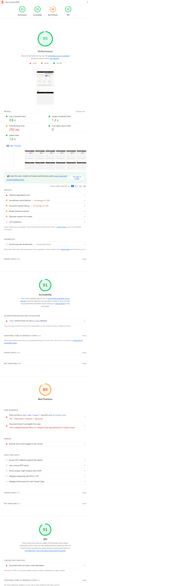
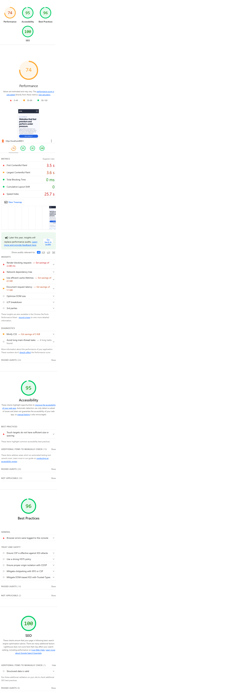

# Accessibility & Performance Audit

## Overview

This project contains a before/after website audit workflow with Lighthouse and axe evidence, plus documentation prepared for report submission and demo presentation.

## Documentation Package

- `audit-report.md` - structured technical audit report (summary, issues table, score comparison)
- `demo-presentation-report.md` - presentation-ready narrative report for demo/review meetings
- `demo-presentation-report.pdf` - ready-to-share PDF presentation report
- `demo-presentation-report.doc` - Word-openable report format
- `before-lighthouse-export.report.html` - Lighthouse HTML report (before)
- `after-lighthouse-export.report.html` - Lighthouse HTML report (after)

## Current Score Snapshot

Source: exported Lighthouse JSON reports.

| Category       | Before | After | Delta |
| -------------- | -----: | ----: | ----: |
| Performance    |     95 |    74 |   -21 |
| Accessibility  |     91 |    95 |    +4 |
| Best Practices |     89 |    96 |    +7 |
| SEO            |     91 |   100 |    +9 |

## Screenshot Evidence

The following score screenshots are generated and included:

- `screenshots/lighthouse-before.png`
- `screenshots/lighthouse-after.png`

Preview:

## Project Structure

- `before/` - original baseline website
- `after/` - redesigned website
- `screenshots/` - Lighthouse screenshot evidence

## How to Run Locally

1. Start baseline page:
   - `python -m http.server 8000 --directory before`
2. Start redesigned page:
   - `python -m http.server 8001 --directory after`
3. Open reports:
   - `before-lighthouse-export.report.html`
   - `after-lighthouse-export.report.html`
4. Review documentation:
   - `audit-report.md`
   - `demo-presentation-report.md`

## Export to PDF or Word

For PDF:

1. Open `demo-presentation-report.md` in VS Code Markdown preview.
2. Print to PDF from the preview/browser print dialog.

For Word:

1. Copy Markdown content into Word, or
2. Convert Markdown to `.docx` using Pandoc if installed.
